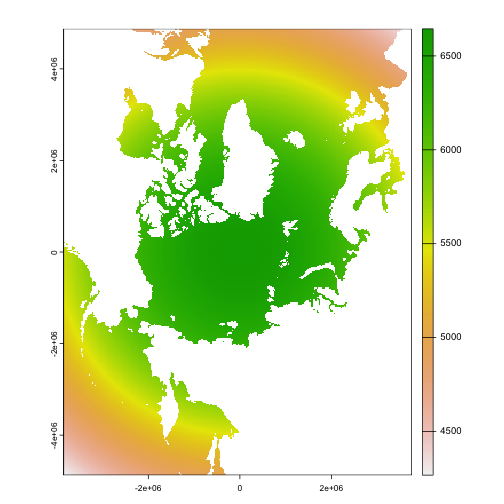

# Calculate sea ice extent

> notebook filename \| sea_ice_extent.Rmd

Calculation of sea ice extent is a common need in the polar regions. This exercise demonstrates how to calculate sea ice area and extent for a projected dataset using the cell area. The R terra package allows us to easily generate the cell areas (even for projected datasets).

This exercise demonstrates the following techniques:

-   Accessing the sea ice data from the PolarWatch ERDDAP\

-   Calculating the area for each cell in the data grid\

-   Plotting the area with a land mask\

-   Calculating the sea ice area\

-   Calculating the sea ice extent\

Key R packages and functions used:

-   **terra::rast** - the spatial raster object for the data\

-   **terra::crs** - a function for assigning a projection to a spatial raster object\

-   **terra::cellSize** - the function to calculate grid cell area\

-   **terra::mask** - a function for applying a land mask to the spatial raster object\

-   **terra::ifel** - a function for getting values based on conditions\

## Getting set up

Terra is an R package for geospatial data handling. Terra handles the spatial analysis of projected data. Learn more about terra via the links in the references section at the end of this tutorial.

The current CRAN version of terra (1.3-4) has a bug so we will need to install the development version (1.3-15). The current CRAN version of terra ()

The code in this exercise was tested with terra 1.3-15 and 1.7-38.

`install.packages('terra')`

*Note: Installing terra depends on R 3.5.0 or newer and imports the Rcpp and raster packages.*


```r
# Load terra, make sure you have it installed first, see above
library(terra)
```

```
## terra 1.7.18
```

```
## 
## Attaching package: 'terra'
```

```
## The following object is masked from 'package:scales':
## 
##     rescale
```

```
## The following object is masked from 'package:rgdal':
## 
##     project
```

```
## The following object is masked from 'package:knitr':
## 
##     spin
```

```r
# Set up download method as libcurl, this is only needed for Windows machines
options(download.file.method="libcurl", url.method="libcurl")
```

# Get the sea ice data from ERDDAP

Here we download the average monthly sea ice concentration for the Arctic in December 2019. We are using the NSIDC Sea Ice Concentration Climate Data Record (NSIDC ID: G002202). We will download a netCDF file and then load it in as a spatial raster.


```r
data_url <- "https://polarwatch.noaa.gov/erddap/griddap/nsidcG02202v4nhmday.nc?cdr_seaice_conc_monthly[(2022-12-01T00:00:00Z):1:(2022-12-01T00:00:00Z)][(4851137.11):1:(-4850758.92)][(-3850000.0):1:(3750000.0)]"

f <- 'nsidcG02202v4nhmday.nc'
download.file(data_url, destfile=f, mode="wb")
```

# Calculate the cell areas

-   Create spatial object
-   Assign the coordinate reference system. Here we use the EPSG code as decribed in the dataset metadata
-   Calculate the cell areas
-   View the nominal generic resolution


```r
ice_rast <- rast(f)
crs(ice_rast) <- "epsg:3413"
res(ice_rast)
```

```
## [1] 25000 25000
```

Calculate the generic cell area, without using the projection info


```r
nominal_cell_area <- cellSize(ice_rast, mask=F, unit="m", transform=FALSE)
nominal_cell_area
```

```
## class       : SpatRaster 
## dimensions  : 390, 304, 1  (nrow, ncol, nlyr)
## resolution  : 25000, 25000  (x, y)
## extent      : -3850000, 3750000, -4875000, 4875000  (xmin, xmax, ymin, ymax)
## coord. ref. : WGS 84 / NSIDC Sea Ice Polar Stereographic North (EPSG:3413) 
## source(s)   : memory
## name        :     area 
## min value   : 6.25e+08 
## max value   : 6.25e+08 
## time        : 2022-12-01 UTC
```

Calculate the actual area, using the projection info


```r
true_cell_area <- cellSize(ice_rast, mask=F, unit="m", transform=TRUE)
true_cell_area
```

```
## class       : SpatRaster 
## dimensions  : 390, 304, 1  (nrow, ncol, nlyr)
## resolution  : 25000, 25000  (x, y)
## extent      : -3850000, 3750000, -4875000, 4875000  (xmin, xmax, ymin, ymax)
## coord. ref. : WGS 84 / NSIDC Sea Ice Polar Stereographic North (EPSG:3413) 
## source(s)   : memory
## name        :      area 
## min value   : 426740576 
## max value   : 664430336
```

Plot the true cell area in km squared with a land mask


```r
masked_area <- mask(true_cell_area, ice_rast) /100000
plot(masked_area)
```



# Calculate the sea ice area

-   The sea ice concentration data is stored in the spatial raster object (ice_rast).
-   The concentration values are represented as ice fraction
-   Sea ice area can be calculated by multiplying the ice fraction values by the calculated cell area
-   Sea ice extent value is defined as 1 for ice fraction equal or greater than 0.15 and 0 otherwise. First
-   so we can simply multiply the ice values by the calculated cell area to determine the overall ice area.
-   The resulting sea ice area is in square kilometers


```r
x <- ice_rast * masked_area
sia <- global(x, "sum", na.rm=TRUE)
sia
```

```
##                               sum
## cdr_seaice_conc_monthly 111048529
```

# Calculate the sea ice extent

-   Similar to the total sea ice calculation, the concentration values represented as ice fraction are used for the extent calculation

-   Sea ice extent defines each grid as either "ice-covered" or "not ice-covered" with a threshold value, typically 15%. In extent calculation, the sea ice concentration fractions first need to be converted to 1 if the fraction value is equal or greater than 0.15 and 0 otherwise. More information about extent can be found from NSIDC page below

-   Sea ice extent can be calculated by multiplying the extent value of 0 and 1 by the calculated cell area.

-   The resulting sea ice extent is in square kilometers.


```r
new_r <- ifel(x > 0.15, 1, 0)
extent <- global(new_r, "sum", na.rm=TRUE)
extent
```

```
##                           sum
## cdr_seaice_conc_monthly 21085
```

# References

R package Terra: <https://cran.r-project.org/web/packages/terra/>

Terra tutorials, Robert J. Hijmans: <https://rspatial.org/spatial-terra>

Sea Ice Dataset Source and Background Information: NOAA/NSIDC Climate Data Record of Passive Microwave Sea Ice Concentration, Version 4. Data Set ID: G02202. <https://nsidc.org/data/g02202>
