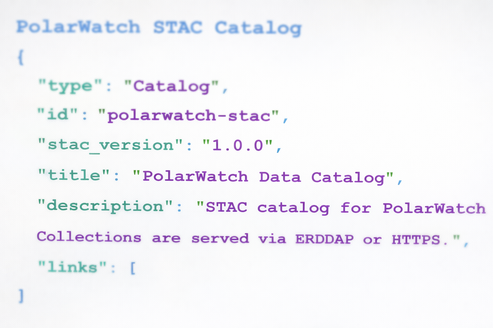
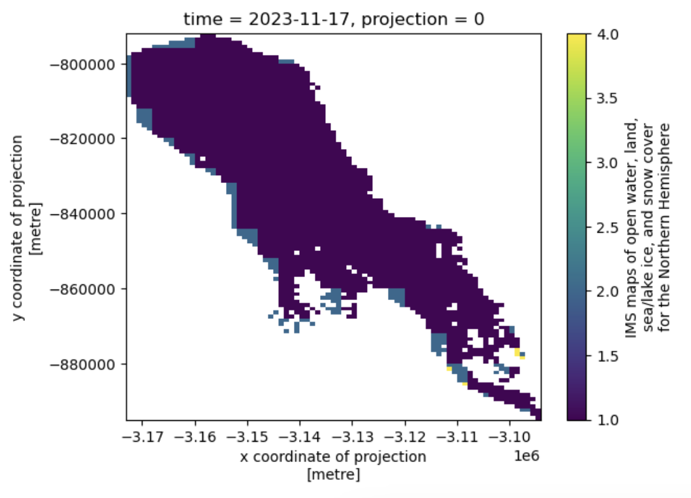
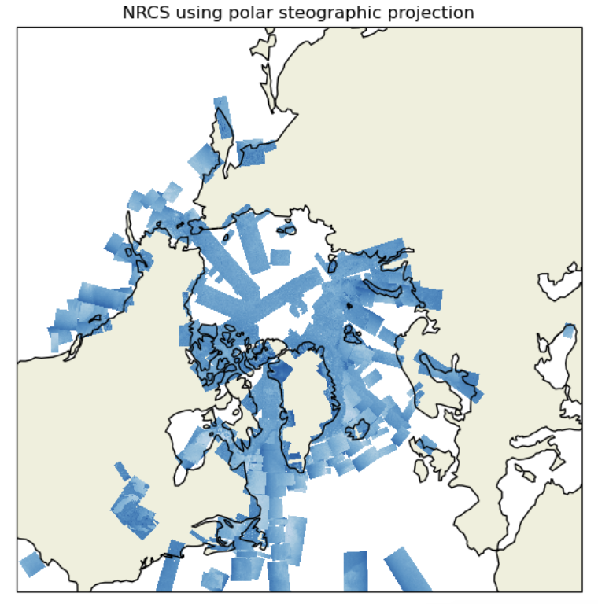
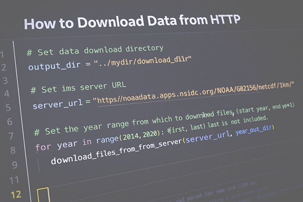

Browse selected Python code examples below.

:::: {.gallery-grid}

::: {.gallery-card}
[{alt="STAC thumbnail"}](https://github.com/polarwatch/data-proc-utilities/blob/main/python/access_polarwatch_stac.ipynb){target="_blank" rel="noopener noreferrer"}

### [Discover Datasets](https://github.com/polarwatch/code-gallery/tree/main/code_samples/polarwatch-catalog){target="_blank" rel="noopener noreferrer" .gallery-card-title}

::: {.gallery-card-text}
Explore the PolarWatch catalog programmatically and access datasets through ERDDAP or HTTPS.
:::
:::

::: {.gallery-card}
[{alt="Lake thumbnail"}](https://github.com/polarwatch/data-proc-utilities/blob/main/python/clip_data_to_shapefile.ipynb){target="_blank" rel="noopener noreferrer"}

### [Subset Data Using a Shapefile](https://github.com/polarwatch/data-proc-utilities/blob/main/python/clip_data_to_shapefile.ipynb){target="_blank" rel="noopener noreferrer" .gallery-card-title}

::: {.gallery-card-text}
Follow an example to clip projected data using a shapefile in a different geographic projection.
:::
:::

::: {.gallery-card}
[{alt="IMS thumbnail"}](https://github.com/polarwatch/data-proc-utilities/blob/main/python/convert_coords_projections.ipynb){target="_blank" rel="noopener noreferrer"}

### [Convert Coordinates](https://github.com/polarwatch/data-proc-utilities/blob/main/python/convert_coords_projections.ipynb){.gallery-card-title}

::: {.gallery-card-text}
Learn how to convert coordinates between different projections — a crucial step when working with geospatial datasets from multiple sources.

:::
:::

::: {.gallery-card}
[{alt="Code thumbnail"}](https://github.com/polarwatch/data-proc-utilities/blob/main/python/download_data_from_https.ipynb){target="_blank" rel="noopener noreferrer"}

### [Download data](https://github.com/polarwatch/data-proc-utilities/blob/main/python/download_data_from_https.ipynb){target="_blank" rel="noopener noreferrer" .gallery-card-title}

::: {.gallery-card-text}
Learn how to download data from an HTTPS source using Python, a common workflow when accessing online datasets and APIs.
:::
:::

::::